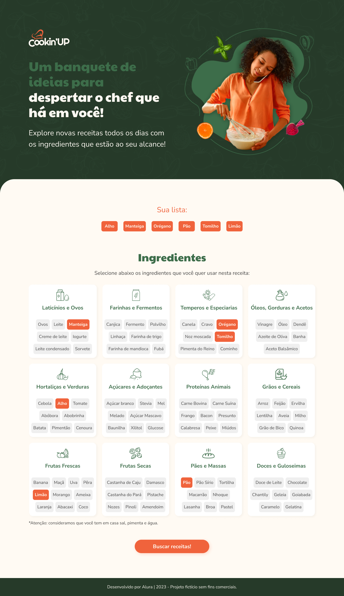
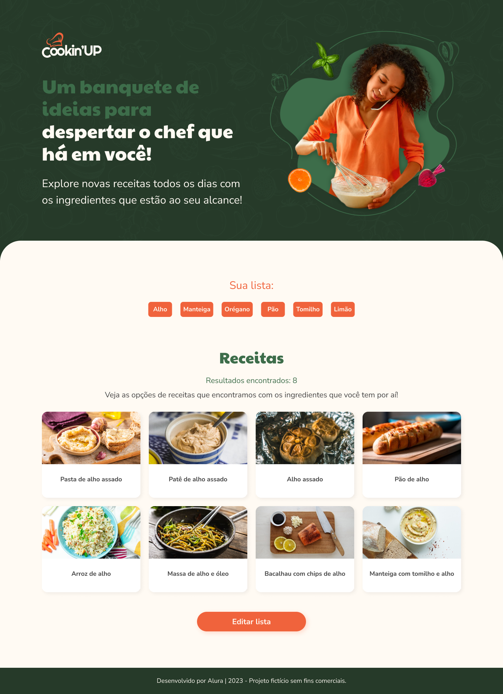

# Cookin' Up!

Projeto feito no curso da Alura **Vue 3: entendendo componentes, diretivas e reatividade no framework**.





No Cookin' Up, você vai selecionando ingredientes para construir a sua lista de ingredientes. Em seguida, é possível buscar as receitas possíveis de serem feitas com os ingredientes da sua lista!

## Setup do projeto

Após baixar ou clonar o repositório, abra o terminal do seu computador na pasta do projeto e execute o comando abaixo:

```sh
npm install
```

Aguarde a instalação das dependências. Ao finalizar, execute o seguinte comando para rodar o servidor Vite:

```sh
npm run dev
```

O Vite irá disponibilizar um link local para você abrir a aplicação em seu navegador. Esse último comando deve ser executado sempre que você abrir o VSCode e quiser visualizar o projeto.
